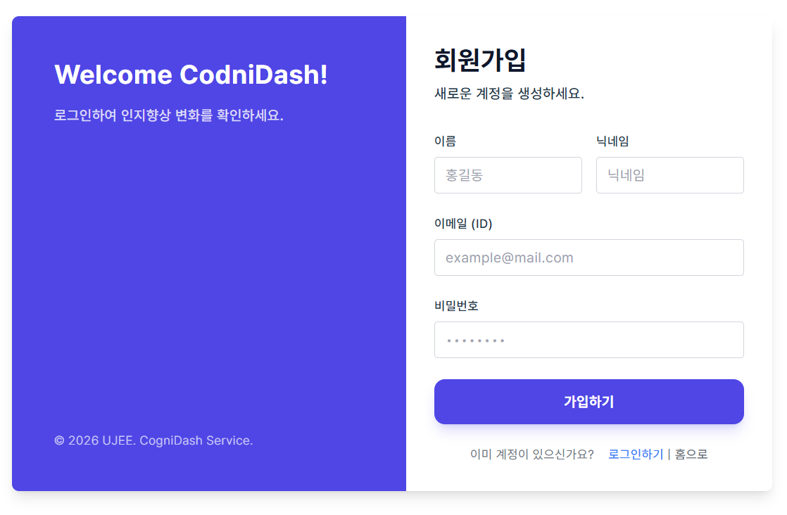
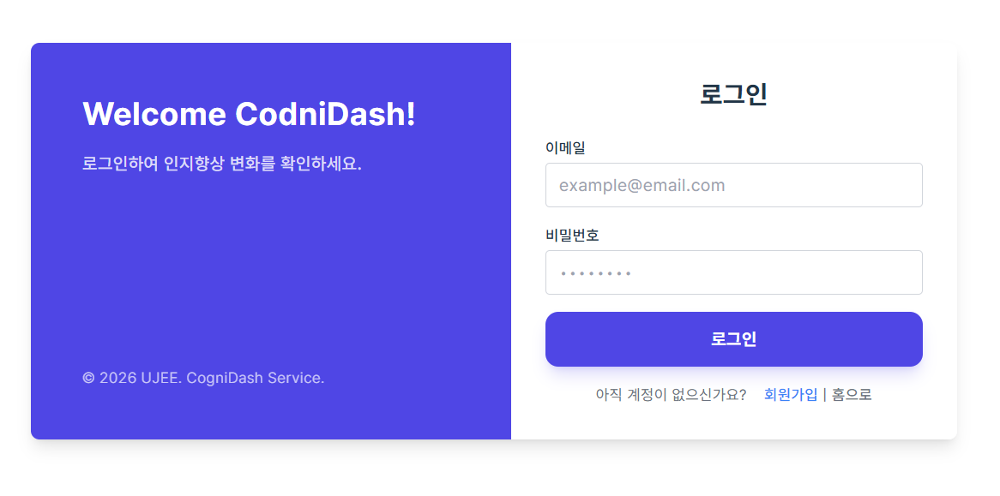
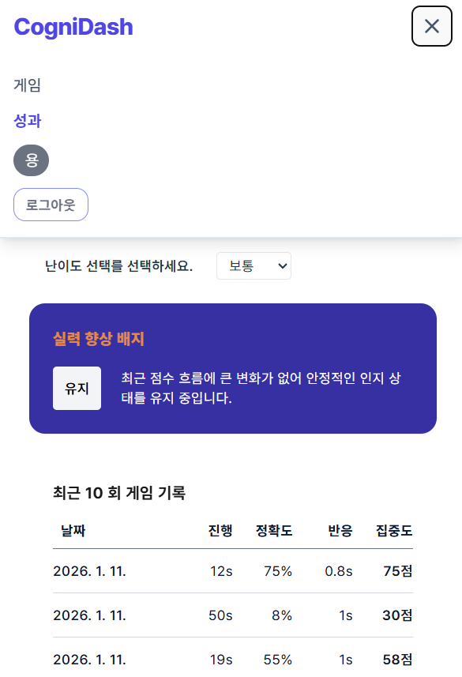
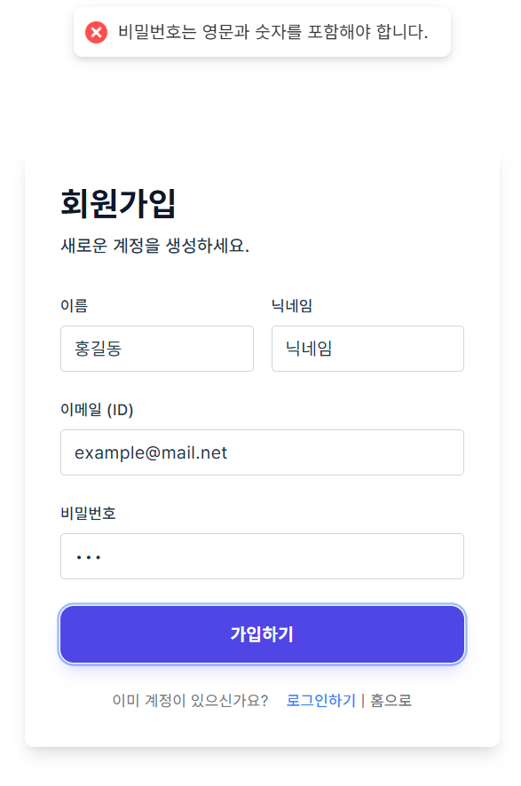
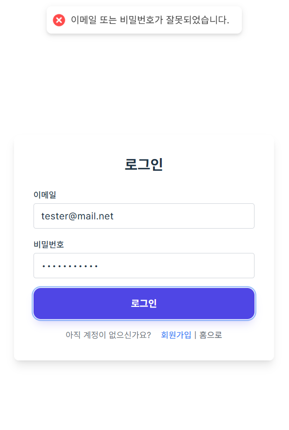

# 카드 매칭 인지 훈련 & 성과 분석 시스템 (Full-Stack)

> JWT 인증과 보안 설계를 기반으로
> 사용자의 인지 반응 데이터를 신뢰 가능한 성과 지표로 분석하는
> 카드 매칭 기반 인지 훈련 풀스택 프로젝트

기존 로컬 환경의 카드 매칭 게임을 확장하여,
**NestJS와 MongoDB 기반 JWT 인증 체계**를 도입하고
사용자의 인지 지표를 서버에서 통합 관리하는 풀스택 프로젝트입니다.

단순한 게임 플레이를 넘어,
**사용자의 반응속도와 정확도 데이터를 수집하고 이를 정교한 알고리즘(집중도 점수)으로 분석**하는 것에 초점을 맞추고 있습니다.

---

## 프로젝트 개요

- **Frontend**: 게임 UI, 사용자 상호작용, 데이터 시각화
- **Backend**: 인증, (예정: 사용자 관리, 기록 저장, 분석 로직)
- **핵심 주제**

  - JWT 인증 구조 설계
  - Refresh Token 보안 강화
  - 인지 데이터의 통계적 신뢰도 확보

---

## 기술 스택

### Frontend (`client/`)

- React(19.2.3), TypeScript, Vite
- Tailwind CSS
- Axios (Interceptor 기반 인증 처리)
- Recharts (성과 시각화)

### Backend (`server/`)

- Node.js(22.19.3), NestJS(11.0.2)
- MongoDB (Mongoose)
- Passport (JWT / JWT-Refresh Strategy)
- bcrypt (비밀번호 & 토큰 해시)
- class-validator
- RxJS

### 기타

- JWT, HttpOnly, Cookie, Playwright(E2E 테스트)

---

## 인증 / 보안 설계 (JWT)

### 인증 구조 요약

> Access Token은 메모리 상태(Context/State)에만 저장되며
> localStorage / sessionStorage에는 저장하지 않습니다.

| 구분               | 방식                           |
| ------------------ | ------------------------------ |
| Access Token       | JWT (15분), 응답 Body          |
| Refresh Token      | JWT (7일), **HttpOnly Cookie** |
| Refresh Token 저장 | **DB에 bcrypt 해시로 저장**    |
| 동시 로그인        | 마지막 로그인만 유지           |
| 로그아웃           | DB 토큰 폐기 + 쿠키 삭제       |

---

### Refresh Token 보안 전략

#### 1. DB 해시 저장

- Refresh Token 원문은 **절대 DB에 저장하지 않음**
- DB 유출 시에도 토큰 재사용 불가

#### 2. Rotation 적용

- Refresh 요청 시마다 **새 토큰 발급**
- 이전 Refresh Token 즉시 무효화
- 탈취된 토큰 **재사용 공격 방어**

#### 3. 단일 세션 유지

- 사용자당 `currentHashedRefreshToken` 하나만 유지
- 새로운 로그인 → 기존 세션 즉시 종료

> 본 프로젝트에서는 보안 검증과 토큰 회전 로직의 명확성을 위해  
> 의도적으로 단일 세션 정책을 채택했습니다.

#### 4. 로그아웃 무효화

- DB의 Refresh Token 제거
- 쿠키 즉시 삭제

#### 5. Refresh Token 검증 실패 시

- Access Token 즉시 제거
- 전역 인증 상태 초기화
- 로그인 화면으로 리다이렉트

---

### 인증 흐름

```text
[Login]
  └─ 이메일 / 비밀번호 검증
      ├─ Access Token 발급 (Body)
      └─ Refresh Token 발급 (HttpOnly Cookie)
           └─ bcrypt 해시 후 DB 저장

[Access Token 만료]
  └─ /auth/refresh
      ├─ 쿠키의 Refresh Token 검증
      ├─ DB 해시와 비교
      ├─ 새 Access / Refresh Token 발급
      └─ DB 토큰 교체 (Rotation)

[Logout]
  ├─ DB Refresh Token 제거
  └─ 쿠키 삭제
```

---

### 보안 테스트 및 검증

- Refresh Token 재사용 공격 → **401 Unauthorized**
- DB에서 토큰 임의 변경 → 다음 Refresh 시 로그아웃 처리
- 로그아웃 후 Refresh 시도 → 실패
- 테스트 API는 모두 제거 후 Postman/curl/브라우저로 검증

---

## 데이터 아키텍처 개선

- 기존 문제: `localStorage` 중심, 기기 변경 시 데이터 단절, 사용자 식별 불가
- 개선: 인증 기반 사용자 식별 → 서버 저장 → 기기 무관 기록 조회 → 로그인 시 데이터 연속성 확보

* **현재 상태**: 게임 기록 저장 기능은 **향후 구현 예정**입니다.

---

## 인지 지표 설계 (집중도 점수)

- 정확도(60%) + 반응속도(40%) 가중치 적용
- 무작위 클릭 방지
- 미진행 게임 데이터 필터링

```ts
skillScore = accuracy * 0.6 + normalizedReactionTime * 0.4;
```

---

## Database Schema (MongoDB)

### User

- `email`: String (Unique, required, Indexed)
- `password`: String (Hashed with bcrypt)
- `currentHashedRefreshToken` (nullable)
- `name`: String (required)
- `nickname`: String (required)
- `profileImage`: String

### Record

- `userId`: ObjectId (Ref: User)
- `difficulty`: String (easy, normal, hard)
- `clearTime`: Number
- `flipCount`: Number
- `createdAt`: Date (Timestamps)

> Record 스키마는 최소 필드로 설계되었으며,
> 실제 서비스 단계에서는 반응속도 분포, 세션 메타데이터 등이 확장될 예정입니다.

---

## 실행 방법

### 환경 변수

```bash
# server
MONGO_URI=
JWT_SECRET=
JWT_REFRESH_SECRET=

# client
VITE_APP_API_URL=
```

### 설치 및 구동

```bash
# Server 실행
cd server
npm install
npm run start:dev

# Client 실행
cd client
npm install
npm run dev
```

---

## 화면 구성 (현재 개발 상태)

### 홈 & 게임 플레이

<table>
<tr>
  <td align="center">홈 화면 (full)</td>
  <td align="center">게임 대기 (min)</td>
  <td align="center">플레이 (min)</td>
</tr>
<tr>
  <td align="center" valign="top"></td>
  <td align="center" valign="top"></td>
  <td align="center" valign="top"></td>
</tr>
</table>

### 단일 게임 결과

<table>
<tr>
  <td align="center">결과 1 (min)</td>
  <td align="center">결과 2 (min)</td>
</tr>
<tr>
  <td align="center" valign="top"></td>
  <td align="center" valign="top"></td>
</tr>
</table>

### 성과 분석

<table>
<tr>
  <td align="center">실력 향상 판정 (min)</td>
  <td align="center">분석 대시보드 1 (min)</td>
  <td align="center">분석 대시보드 2 (min)</td>
</tr>
<tr>
  <td align="center" valign="top"></td>
  <td align="center" valign="top"></td>
  <td align="center" valign="top"></td>
</tr>
</table>

### 로그인 / 회원가입

<table>
<tr>
  <td align="center">회원 가입 (full)</td>
  <td align="center">로그인 (full)</td>
  <td align="center">로그인 메뉴 (min)</td>
</tr>
<tr>
  <td align="center" valign="top"></td>
  <td align="center" valign="top"></td>
  <td align="center" valign="top"></td>
</tr>
</table>

### toast

<table>
<tr>
  <td align="center">비밀번호 규칙 (min)</td>
  <td align="center">로그인 불일치 (min)</td>
</tr>
<tr>
  <td align="center" valign="top"></td>
  <td align="center" valign="top"></td>
</tr>
</table>
---

## 설계 포인트 (Insight)

> "데이터를 관찰하기 위해 게임을 설계하다"

- 프론트엔드에서 수집된 미세한 반응 시간 → 백엔드 → DB → 신뢰 가능한 성과 지표
- 비동기 통신 예외 처리 및 타입 안전성 확보
- 게임 로직과 통계 로직 분리: 게임은 측정만, 해석은 성과 화면에서 수행
- 단일 지표가 아닌 복합 지표 기반 실력 판단
- “유효 게임” 필터링으로 통계 신뢰도 확보

---

### 프로젝트 구조 다이어그램

```text
[      Game Screen    ]
          │
          ▼
┌─────────────────────┐
    Game Logic Layer
   - 카드 상태 관리
   - 타이머 관리
   - 매칭 판정
   - 정확도 계산
   - 반응 속도 기록
└─────────┬───────────┘
          ▼
┌─────────────────────┐
      Game Result
   - totalAttempts
   - correctMatches
   - failedAttempts
   - accuracy
   - avgReactionTime
   - duration
   - skillScore
└─────────┬───────────┘
          ▼
┌─────────────────────┐
     Local Storage
└─────────┬───────────┘
          ▼
┌─────────────────────┐
    Performance Page
   - 난이도 필터
   - 실력 판정
   - 최근 N회 추이
   - 차트 시각화
   - 평균 비교
   - 최고/최저 반응 속도
└─────────────────────┘
```

---

### 집중도 점수 설계

```ts
skillScore = accuracy * 0.6 + normalizedReactionTime * 0.4;

accuracy =
  attempts === 0
    ? 0
    : Math.round((correctMatches / attempts) * (correctMatches / pairs) * 100);

normalizedReactionTime =
  sec <= 0.4
    ? 100
    : sec >= 2.0
    ? 0
    : Math.round(100 - ((sec - 0.4) / 1.6) * 100);
```

- 정확도 비중 ↑, 반응속도 보조
- 미진행 게임 제외 → 통계 신뢰도 확보
- 최근 N회 이동 평균선 → 실력 추세 시각화

---

### 실력 향상 판정 로직

- 단기(2~4회): 첫 기록 대비 마지막 기록 변화율 ±20% 이상 → 향상/저하
- 장기(5회 이상): 전반부 평균 vs 후반부 평균 비교 → 향상/저하/유지
- 변화율 0% → 메시지 생략

---

## E2E 테스트 (Playwright)

- **설치**

```bash
cd client
npm create playwright@latest
npm install @playwright/test
npx playwright install
```

- **환경 파일**: `.env.test` (`CLIENT_URL`, `SERVER_URL`, `TEST_EMAIL`, `TEST_PASSWORD`)

- **테스트 폴더**: `e2e`

- **실행**: `npx playwright test` 또는 `npx playwright test --ui`

- **주요 시나리오**

  1. 비로그인 → 보호된 페이지 접근 → 로그인 페이지 이동
  2. 로그인 → 보호된 페이지 접근 가능
  3. 새로고침 → 로그인 유지
  4. accessToken 만료 → refresh → 페이지 유지
  5. refresh 실패 → 강제 로그아웃
  6. 멀티탭 로그아웃 동기화

---

## 향후 개선 아이디어

- 대용량 데이터 최적화
- 다중 기기 로그인 허용 → Refresh Token 테이블 분리
- IP/User-Agent 기반 추가 검증
- 단위 테스트(Auth/Service)
- 랭킹/공유/댓글 기능
- 반응속도 일관성 지표 추가
- 게임 중 이탈 처리 정책
- 게임 종류 확장 대비 공통 인터페이스 설계

---

## 마무리

이 프로젝트는
**게임을 만들기 위해 데이터를 쓰는 것이 아니라, 데이터를 관찰하기 위해 게임을 만든 사례**입니다.

JWT 인증, Refresh Token 보안 전략, 프론트엔드 상태 관리, 통계적 노이즈 제거까지
하나의 사용자 경험으로 통합하는 데 중점을 두었습니다.
