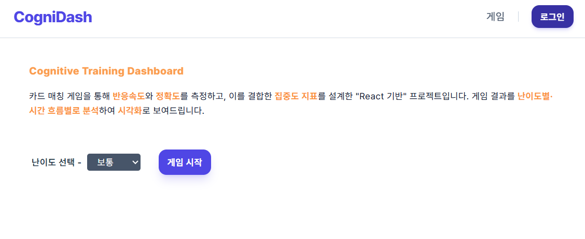
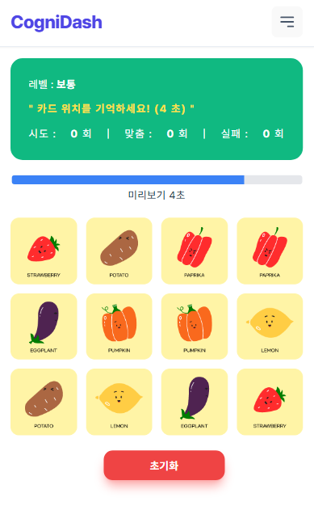
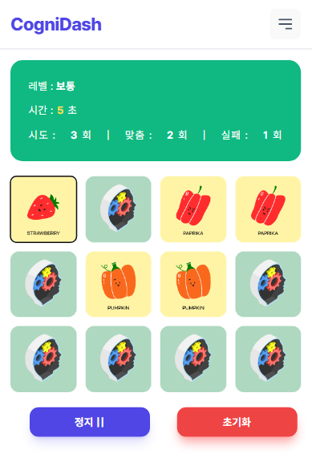
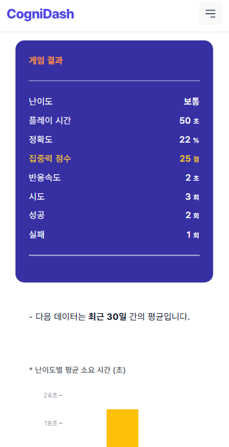
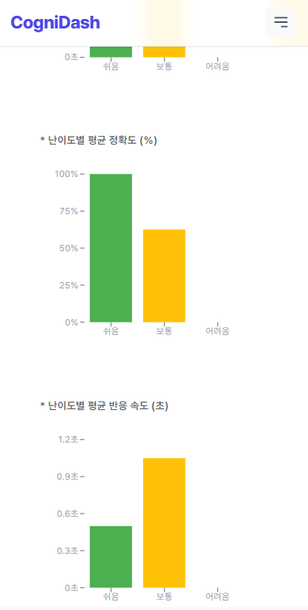

# 카드 매칭 인지 훈련 & 성과 분석 시스템 (Full-Stack)

> JWT 인증과 보안 설계를 기반으로  
> 사용자의 인지 반응 데이터를 신뢰 가능한 성과 지표로 분석하는  
> 카드 매칭 기반 인지 훈련 풀스택 프로젝트

기존 로컬 환경의 카드 매칭 게임을 확장하여,
**NestJS와 MongoDB 기반의 JWT 인증 체계**를 도입하고
사용자의 인지 지표를 서버에서 통합 관리하는 풀스택 프로젝트입니다.

단순한 게임 플레이를 넘어,
**사용자의 반응속도와 정확도 데이터를 수집하고 이를 정교한 알고리즘(집중도 점수)으로 분석**하는 것에
초점을 맞추고 있습니다.

---

## 프로젝트 개요

- **Frontend**: 게임 UI, 사용자 상호작용, 데이터 시각화
- **Backend**: 인증, 사용자 관리, 기록 저장, 분석 로직
- **핵심 주제**

  - JWT 인증 구조 설계
  - Refresh Token 보안 강화
  - 인지 데이터의 통계적 신뢰도 확보

---

## 기술 스택

### Frontend (`client/`)

- React, TypeScript, Vite
- Tailwind CSS
- Axios (Interceptor 기반 인증 처리)
- Recharts (성과 시각화)

### Backend (`server/`)

- NestJS
- MongoDB (Mongoose)
- Passport (JWT / JWT-Refresh Strategy)
- bcrypt (비밀번호 & 토큰 해시)

---

## 인증 / 보안 설계 (JWT)

### 인증 구조 요약

> Access Token은 메모리 상태(Context/State)에만 저장되며  
> localStorage / sessionStorage에는 저장하지 않습니다.

| 구분               | 방식                           |
| ------------------ | ------------------------------ |
| Access Token       | JWT (15분), 응답 Body          |
| Refresh Token      | JWT (7일), **HttpOnly Cookie** |
| Refresh Token 저장 | **DB에 bcrypt 해시로 저장**    |
| 동시 로그인        | 마지막 로그인만 유지           |
| 로그아웃           | DB 토큰 폐기 + 쿠키 삭제       |

---

### Refresh Token 보안 전략

#### 1. DB 해시 저장

- Refresh Token 원문은 **절대 DB에 저장하지 않음**
- DB 유출 시에도 토큰 재사용 불가

#### 2. Rotation 적용

- Refresh 요청 시마다 **새 토큰 발급**
- 이전 Refresh Token 즉시 무효화
- 탈취된 토큰 **재사용 공격 방어**

#### 3. 단일 세션 유지

- 사용자당 `currentHashedRefreshToken` 하나만 유지
- 새로운 로그인 → 기존 세션 즉시 종료

> 본 프로젝트에서는 보안 검증과 토큰 회전 로직의 명확성을 위해  
> 의도적으로 단일 세션 정책을 채택했습니다.

#### 4. 로그아웃 무효화

- DB의 Refresh Token 제거
- 쿠키 즉시 삭제

#### 5. Refresh Token 검증 실패 시

- Access Token 즉시 제거
- 전역 인증 상태 초기화
- 로그인 화면으로 리다이렉트

---

### 인증 흐름

```text
[Login]
  └─ 이메일 / 비밀번호 검증
      ├─ Access Token 발급 (Body)
      └─ Refresh Token 발급 (HttpOnly Cookie)
           └─ bcrypt 해시 후 DB 저장

[Access Token 만료]
  └─ /auth/refresh
      ├─ 쿠키의 Refresh Token 검증
      ├─ DB 해시와 비교
      ├─ 새 Access / Refresh Token 발급
      └─ DB 토큰 교체 (Rotation)

[Logout]
  ├─ DB Refresh Token 제거
  └─ 쿠키 삭제
```

---

### 보안 테스트 및 검증

- Refresh Token 재사용 공격 → **401 Unauthorized**
- DB에서 토큰 임의 변경 →

  - 기존 Access Token은 TTL 동안 유지
  - **다음 Refresh 시 로그아웃 처리**

- 로그아웃 후 Refresh 시도 → **실패**

> Refresh Token은 “즉시 로그아웃”이 아니라
> \*\*“다음 재발급 시점부터 무효화”되는 구조로 설계되었습니다.
> 이는 실무에서 일반적으로 사용하는 UX 친화적 방식입니다.

---

### 테스트 API 제거

- 초기 개발 단계에서 사용한 **임시 인증 / 테스트용 API는**
  **보안 구조 완성 후 모두 제거**

- 현재 인증 테스트는:

  - Postman / curl
  - 브라우저 (서로 다른 브라우저 / 시크릿 모드)
    방식으로 수행

---

## 데이터 아키텍처 개선

### 기존 문제

- `localStorage` 중심 구조
- 기기 변경 시 데이터 단절
- 사용자 식별 불가

### 개선

- 인증 기반 사용자 식별
- 서버 저장 → **기기 무관 기록 조회**
- 로그인 시 데이터 연속성 확보

---

## 인지 지표 설계 (집중도 점수)

- 정확도(60%) + 반응속도(40%) 가중치 적용
- 무작위 클릭 방지
- 미진행 게임 데이터 필터링

```ts
skillScore = accuracy * 0.6 + normalizedReactionTime * 0.4;
```

---

## Database Schema (MongoDB)

### User

- `email`: String (Unique, required, Indexed)
- `password`: String (Hashed with bcrypt)
- `currentHashedRefreshToken` (nullable)
- `name`: String (required)
- `nickname`: String (required)
- `profileImage`: String

### Record (현재 테스트용)

> Record 스키마는 인증·보안 검증을 우선하기 위해  
> 최소 필드로 설계된 상태이며,  
> 실제 서비스 단계에서는 반응속도 분포, 세션 메타데이터 등이 확장될 예정입니다.

- `userId`: ObjectId (Ref: User)
- `difficulty`: String (easy, normal, hard)
- `clearTime`: Number
- `flipCount`: Number
- **`createdAt`**: Date (System generated by Timestamps)

---

## 실행 방법 (Node.js v20.19.6)

### 환경 변수

```bash
# server
MONGO_URI=
JWT_SECRET=
JWT_REFRESH_SECRET=

# client
VITE_APP_API_URL=
```

### 설치 및 구동

```bash
# Server 실행
cd server
npm install
npm run start:dev

# Client 실행
cd client
npm install
npm run dev

```

---

## 화면 구성 (현재 개발 상태)

### 홈 & 게임 플레이

|                     홈 화면                     |                        게임 대기                        |                     실제 플레이                      |
| :---------------------------------------------: | :-----------------------------------------------------: | :--------------------------------------------------: |
|  |  |  |

### 단일 게임 결과

|                          결과 1                          |                          결과 2                          |
| :------------------------------------------------------: | :------------------------------------------------------: |
|  |  |

### 성과(Performance) 분석

|                        실력 향상 판정                         |                        분석 대시보드 1                        |                        분석 대시보드 2                        |
| :-----------------------------------------------------------: | :-----------------------------------------------------------: | :-----------------------------------------------------------: |
|  |  |  |

---

## 설계 포인트 (Insight)

> "데이터를 관찰하기 위해 게임을 설계하다"

본 프로젝트는 프론트엔드에서 수집된 미세한 사용자 행동(반응 시간)이
백엔드와 DB를 거쳐 어떻게 **신뢰할 수 있는 성과 지표**로 가공되는지에 대한 전 과정을 다룹니다.
특히, **비동기 통신에서의 예외 처리(Try-Catch-As-AxiosError)**와
**타입 안전성(TypeScript)**을 확보하는 데 주력했습니다.

#### \* [FrontEnd] 현재 로직

- 게임 로직과 통계 로직 완전 분리
  - 게임은 측정만, 해석은 성과 화면에서만 수행
  - 단일 게임과 누적 데이터의 책임을 분리
- 파생 데이터는 `useMemo`로 계산
- “유효 게임” 개념 도입으로 통계 신뢰도 확보
- 단일 지표가 아닌 **복합 지표 기반 실력 판단**
- 도구형 서비스 성격에 맞춰 공통 Header를 사용
- 게임 플레이 중에도 현재 위치와 주요 기능 접근성을 유지

---

### 프로젝트 구조 다이어그램: 전체 흐름

```text
[      Game Screen    ]
          │
          │ (카드 클릭 / 타이머 / 매칭)
          ▼
┌─────────────────────┐
    Game Logic Layer
     (Hooks 중심)

   - 카드 상태 관리
   - 타이머 관리
   - 매칭 판정
   - 정확도 계산
   - 반응 속도 기록
└─────────┬───────────┘
          │
          │ 게임 종료
          ▼
┌─────────────────────┐
      Game Result
      (단일 게임)

   - totalAttempts    : 시도 횟수 (회)
   - correctMatches   : 성공 횟수 (회)
   - failedAttempts   : 실패 횟수 (회)
   - accuracy         : 정확도 (%)
   - avgReactionTime  : 평균 반응 속도 (초)
   - duration         : 플레이 시간 (초)
   - skillScore       : 집중도 (점)
└─────────┬───────────┘
          │ 저장
          ▼
┌─────────────────────┐
     Local Storage
     (Game History)

  StoredGameResult[]
└─────────┬───────────┘
          │ 조회
          ▼
┌─────────────────────┐
    Performance Page
       (성과 분석)

  - 난이도 필터
  - 실력 판정
  - 최근 N회 추이
  - 차트 시각화
  - 평균 비교
  - 최고/최저 반응 속도
└─────────────────────┘
```

---

### 집중도 점수 설계

단순 반응속도는 무작정 빠르게 클릭해도 높아질 수 있습니다.
이를 방지하기 위해 **정확도와 반응속도를 결합한 복합 점수**를 설계했습니다.

- 정확도 비중 ↑
- 반응속도는 보조 지표
- 미진행 게임은 통계에서 제외
- 가중치 상수화로 추후 자동 조정 가능

> “빠르기만 한 플레이”가 아닌
> **정확하고 안정적인 플레이를 높은 점수로 평가**하는 것이 목표입니다.

---

### 집중도 점수 예시 수식 (개념)

- 집중도 (skillScore)

  ```ts
  skillScore = accuracy * ACC_WEIGHT + normalizedReactionTime * REACTION_WEIGHT;
  ```

  - ACC_WEIGHT: 60%
  - REACTION_WEIGHT: 40%

- 정확도 (accuracy): 0 ~ 100

  ```ts
  attempts === 0
    ? 0
    : Math.round((correctMatches / attempts) * (correctMatches / pairs) * 100);
  ```

- reactionTime 정규화 (normalizedReactionTime): 느릴수록 감점
  ```ts
  if (sec <= 0.4) return 100;
  if (sec >= 2.0) return 0;
  return Math.round(100 - ((sec - 0.4) / 1.6) * 100);
  ```

> 현재 가중치는 **실험적 설정**이며,
> 실제 서비스 환경에서는 A/B 테스트를 통해 조정 가능한 구조입니다.

---

### 미진행 게임 제외 이유

#### 문제 상황

- 시간 초과 & 클릭 1회 이하
  > 반응속도 0초로 기록되어 **최고 기록으로 오인**,
  > **집중도** 계산 시 반응속도 가중치가 **40점으로 잘못 적용**됨

#### 해결

- 게임 종료 시 **유효 게임 필터링**하여 저장하지 않음
  ```ts
  avgReactionTime + accuracy > 0;
  ```

➡ 통계 신뢰도 확보

---

### 이동 평균선의 의미

> 개별 게임 결과는 편차가 크기 때문에
> **최근 N(5)회 평균을 연결하여 실질적인 흐름을 파악**하기 위해 사용합니다.

---

### 실력 향상 판정 로직

단순 점수 비교가 아닌,
**데이터 수에 따라 다른 기준을 적용하는 이중 판정 구조**입니다.
판정 결과는 향상 / 저하 / 유지로 구분되며,
수치 변화가 0일 경우 퍼센트 문구는 생략하여 자연스러운 메시지를 제공합니다.

#### 단기 데이터 분석 (2~4개)

- 데이터가 적을 때 발생하는 노이즈 방어
- 첫 기록 대비 마지막 기록 변화율 기준
- 단기 변화율이 ±20% 이상이고 중간 점수가 지나치게 낮지 않을 때만 상태 변화 인정
- 메시지에 변화율이 0%인 경우는 표시하지 않음 → “0% 상승/하락” 어색함 방지

---

#### 장기 추세 분석 (5개 이상)

- 전반부 평균 vs 후반부 평균 비교
- 추세 기반 판정 (`up / down / flat`)
- 최근 평균 점수가 **전체 평균보다 높은지** 추가 확인
- 메시지에 변화율이 있을 경우만 표시, 0% 변화는 생략

➡ 단기 확률적 요인과 장기 안정적 실력 향상을 구분하여,
사용자가 직관적으로 자신의 인지 상태 변화를 이해할 수 있도록 설계되었습니다.

---

## 향후 개선 아이디어

- 대용량 데이터 대비 성능 최적화
- 다중 기기 로그인 허용을 위한 Refresh Token 테이블 분리
- IP / User-Agent 기반 추가 검증
- 테스트 코드 (Auth / Service 단위)
- 랭킹/공유/댓글 기능 추가
- 반응속도 **분산(일관성) 지표** 추가
- 게임 도중 헤더를 클릭해 이탈할 경우 현재 진행 중인
  데이터의 유실 처리(자동 패배 처리 vs 기록 제외)에 대한 정책
- 게임 진행 완료율 추가
  - 현재는 100% 진행만 저장
  - 사용자의 중간 이탈 저장 -> 난이도별 이탈율 분석
- 게임 종류 확장 대비 공통 인터페이스 설계

---

## 마무리

이 프로젝트는
**게임을 만들기 위해 데이터를 쓰는 것이 아니라,
데이터를 관찰하기 위해 게임을 만든 사례**입니다.

이 과정에서 JWT 인증, Refresh Token 보안 전략,
프론트엔드 상태 관리, 통계적 노이즈 제거까지
하나의 사용자 경험으로 통합하는 데 중점을 두었습니다.
