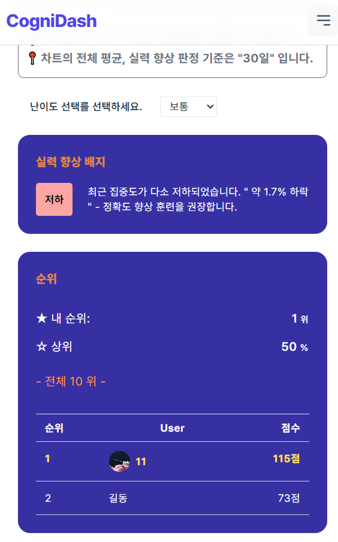
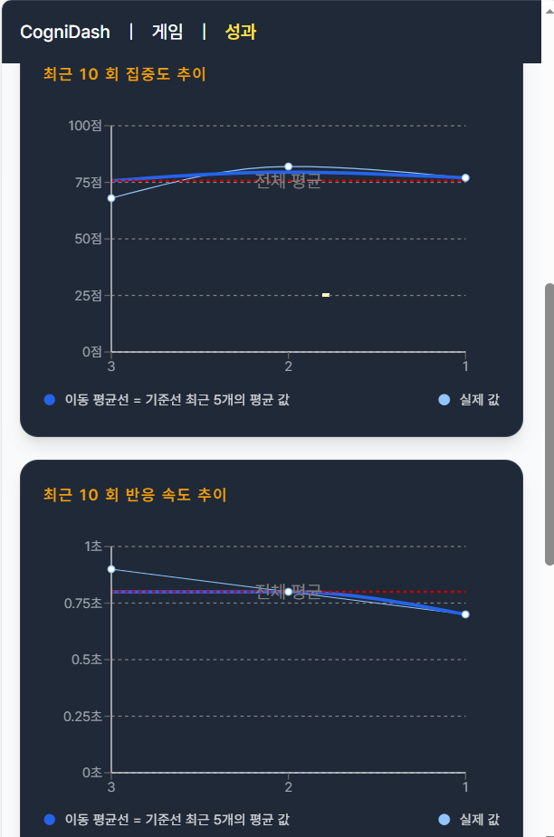
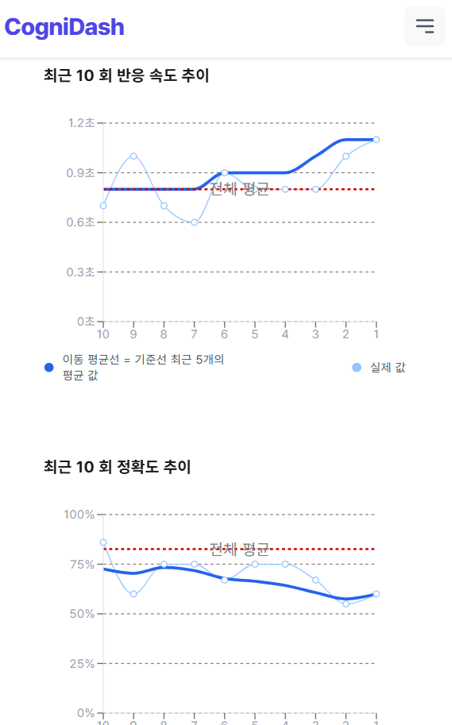
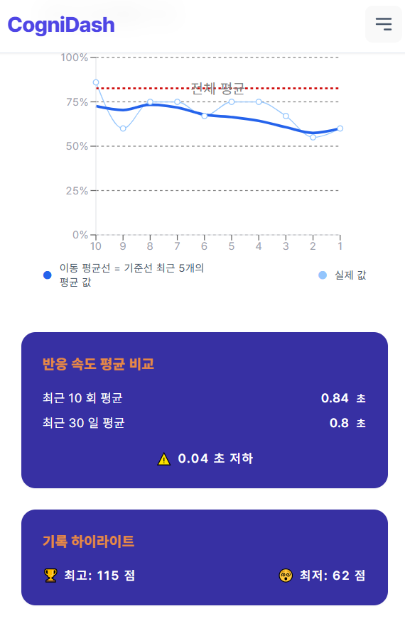

# 카드 매칭 인지 훈련 & 성과 분석 시스템 (Full-Stack)

> JWT 인증과 보안 설계를 기반으로
> 사용자의 인지 반응 데이터를 신뢰 가능한 성과 지표로 분석하는
> 카드 매칭 기반 인지 훈련 풀스택 프로젝트

기존 로컬 환경의 카드 매칭 게임을 확장하여, **MongoDB 기반 JWT 인증 체계**를 도입하고 사용자의 인지 지표를 서버에서 통합 관리하는 풀스택 프로젝트입니다.

단순한 게임 플레이를 넘어, **반응속도와 정확도 데이터를 수집하고, 난이도별 가중치 및 패널티를 적용한 '집중도 점수(Skill Score)' 알고리즘으로 분석**하는 것에 초점을 맞추고 있습니다.

---

## 주요 업데이트

- **집중도 점수(Skill Score) 알고리즘 고도화**

  - 난이도별 가중치(`accuracyWeight`, `reactionWeight`)
  - 점수 배율(`scoreMultiplier`)
  - 실패 패널티(`penaltyWeight`) 도입

- **데이터 소스 최적화**

  - 로그인: 서버 기반 최근 30일 데이터
  - 비로그인: LocalStorage 기반 전체 데이터

- **서버 사이드 성과 분석**

  - 모든 통계·판정·랭킹 계산을 서버에서 수행

- **경쟁 시스템**

  - 집중도 점수 기준 TOP 10 랭킹
  - 내 순위 및 상위 퍼센트(%) 제공

---

## 프로젝트 개요

- **Frontend**

  - 게임 UI, 사용자 상호작용, 데이터 시각화

- **Backend**

  - JWT 인증 / Refresh Token 관리
  - 사용자 계정 관리
  - 게임 기록 저장
  - 성과 분석 및 랭킹 계산

- **핵심 주제**

  - JWT 인증 보안 구조
  - 인지 데이터의 통계적 신뢰도 확보
  - 난이도별 변별력 있는 점수 설계

---

## 기술 스택

### Frontend (`client/`)

- **Core**: React 19, TypeScript, Vite
- **UI**: Tailwind CSS
- **Network**: Axios (Interceptor 기반 인증 및 토큰 갱신)
- **Visualization**: Recharts (추이 시각화)

### Backend (`server/`)

- **Core**: Node.js 22, NestJS 11
- **DB**: MongoDB + Mongoose
- **Security**: Passport (JWT / Refresh), bcrypt, class-validator

### 기타

- Playwright(E2E 테스트)

---

## 인지 지표 및 분석 설계

### 1. 집중도 점수(Skill Score) 산출 공식

사용자의 인지 능력을 다각도로 평가하기 위해 반응 속도와 정확도를 결합한 복합 지표를 사용합니다.

- **반응 점수(Reaction Score)**

  반응속도를 난이도별 기준값에 따라 **0~100 점수로 정규화**

```ts
const scale = REACTION_SCALES[difficulty];

if (avgReactionTime <= scale.minTime) return 100;
if (avgReactionTime >= scale.maxTime) return scale.minScore ?? 0;

const raw =
  100 -
  ((avgReactionTime - scale.minTime) / (scale.maxTime - scale.minTime)) * 100;

return Math.max(scale.minScore ?? 0, Math.round(raw));
```

> 반응 시간이 빠를수록 높은 점수를, 느릴수록 낮은 점수를 부여하여
> 난이도별 기준에 따라 상대적인 반응 성능을 비교할 수 있도록 설계하였습니다.

- **최종 집중도 점수 (Skill Score)**:

```text
  finalScore = (
    (accuracy * accuracyWeight)
     + (reactionScore * reactionWeight)
    )
    * scoreMultiplier
    - (failedAttempts * penaltyWeight)
```

- **난이도별 차등 적용**

  - EASY / NORMAL / HARD 별 가중치 및 배율 상이 -> 변별력 확보

- **페널티 시스템**

  - 무작위 클릭 및 실패 누적 방지
  - `failedAttempts` 발생 시 감점을 부여

- **최소 점수 보장**

  - 0점 미만 방지 (`Math.max(0, ...)`)

> 현재 가중치는 **실험적 설정**이며,
> A/B 테스트 및 사용자 데이터에 따라 조정 가능하도록 설계하였습니다.

### 2. 데이터 제공 정책

| 구분         | 데이터 소스        | 분석 범위     | 비고           |
| ------------ | ------------------ | ------------- | -------------- |
| **비로그인** | `localStorage`     | 전체 누적     | 기기 종속      |
| **로그인**   | **MongoDB Server** | **최근 30일** | 서버 기준 통계 |

---

## 성과 분석 시스템 (Dashboard)

로그인 사용자 전용 기능이며, **모든 수치와 판정은 서버에서 계산**됩니다.

- **실시간 랭킹**: `GameRecord`의 `skillScore` 인덱스를 활용하여 전체 TOP 10 리스트 제공
- **내 위치 파악**: 내 최고 점수 기반 현재 순위 및 상위 퍼센트(%) 산출
- 최근 N회 **이동 평균선** → 실력 추세 시각화
- **실력 향상 판정**:
  - **단기(2~4회)**: 초기 기록 대비 최근 기록 변화율($\pm20\%$) 기반 상태 판정
  - **장기(5회 이상)**: 전반부/후반부 이동 평균 비교를 통한 추세(상승/유지/저하) 분석
- **서버 사이드 판정**: 클라이언트의 가공 없이 서버에서 `GameDifficultyConfig`의 가중치를 적용한 최종 `progress` 객체를 전달하여 보안성과 일관성을 유지

### 성과 분석 화면

<table>
<tr>
  <td align="center">실력 판정, 순위</td>
  <td align="center">최근 10회 기록</td>
  <td align="center">추이 그래프</td>
  <td align="center">비교 (반응속도, 점수)</td>
</tr>
<tr>
  <td align="center" valign="top"></td>
  <td align="center" valign="top"></td>
  <td align="center" valign="top"></td>
  <td align="center" valign="top"></td>
</tr>
</table>

---

## 인증 / 보안 설계 (JWT)

### Refresh Token 보안 전략 (Rotation)

| 구분                 | 방식                                                                    |
| -------------------- | ----------------------------------------------------------------------- |
| **Access Token**     | JWT, `localStorage`에 저장 (인증 유지용)                                |
| **멀티탭 동기화**    | `BroadcastChannel`을 통한 실시간 상태(State) 공유                       |
| **초기 데이터 복구** | 새로고침 시 `localStorage`에서 토큰을 읽어 인증 복구 (`useRestoreUser`) |

1. **DB 해시 저장**: 토큰 원본이 아닌 bcrypt 해시값만 저장하여 DB 유출 피해 최소화
2. **Rotation 적용**: Refresh 요청 시마다 Access/Refresh 토큰을 모두 재발급하며 이전 토큰은 즉시 무효화
3. **멀티탭 동기화**: `BroadcastChannel`을 활용해 한 탭에서 로그아웃/정보 수정 시 모든 탭에 즉시 반영

### 사용자 계정 관리

- **회원정보 수정**: Access Token 인증 필요, 전역 상태 즉시 갱신
- **비밀번호 변경**: 기존 비밀번호 검증 필수, 필요 시 세션 무효화
- **회원 탈퇴**: 비밀번호 재확인, 계정 및 토큰 삭제, 모든 세션 로그아웃

---

## Database Schema (MongoDB)

### 1. User (사용자)

인증 및 세션 관리를 위한 핵심 스키마입니다.

- `email`: 유저 식별자 (Unique, Indexed)
- `password`: bcrypt 해시 비밀번호
- `nickname`, `profileImage`: 프로필 정보
- `currentHashedRefreshToken`: 보안 인증용 해시 토큰

### 2. Game

등록된 인지 훈련 게임의 메타 정보를 관리합니다.

- `code`: URL 및 시스템 식별용 코드 (예: `card-matching`)
- `name`: 사용자 노출용 게임명
- 확장 대비:
  - `isActive`: 활성화 여부 (시즌제/이벤트 대응)
  - `validFrom`, `validTo`: 운영 가능 기간 설정

### 3. GameDifficultyConfig (난이도 설정)

각 게임의 난이도별 규칙 및 **집중도 점수 가중치**를 저장합니다.

- `gameId`: 해당 게임 참조 (Ref: Game)
- `difficulty`: 난이도 구분 (`EASY`, `NORMAL`, `HARD`)
- **게임 규칙**: 카드 쌍, 시간 제한, 미리보기 시간 등
- **점수 가중치**: `scoreMultiplier`, `accuracyWeight`, `reactionWeight`, `penaltyWeight`

### 4. GameRecord (게임 결과 기록)

사용자의 플레이 데이터와 분석된 인지 지표를 저장합니다.

- `userId`, `gameId`: 참조 식별자 (Indexed)
- `difficulty`: 난이도 구분 (`EASY`, `NORMAL`, `HARD`)
- `duration`: 게인 진행 시간
- `skillScore`: 계산된 최종 집중도 점수
- `avgReactionTime`, `accuracy`: 핵심 분석 데이터
- `totalAttempts` `correctMatches` `failedAttempts`: 카드매칭 게임 전용 데이터
- 확장 대비:
  - `reactionTimeDetails`: 개별 반응 시간 배열 (표준편차 분석용)
  - `stdDev`, `consistencyScore`: 인지 안정성, 일관성 지표
  - `theme`: 게임 테마 설정

### 5. Index 전략

- **성능 최적화 (Indexing Strategy)**
  - **사용자별 분석**:
    `{ userId: 1, gameId: 1, difficulty: 1, createdAt: -1 }`
  - **랭킹**:
    `{ gameId: 1, difficulty: 1, skillScore: -1 }`

---

## E2E 인증 테스트 시나리오 (Playwright)

1. **인증 흐름**: 로그인 유지, 새로고침 시 세션 복구, 토큰 만료 시 자동 갱신 테스트
2. **보안 경계**: 비로그인 시 성과 페이지 접근 차단 및 리다이렉트 검증
3. **동기화**: 멀티탭 환경에서의 실시간 상태 공유 확인

---

## 실행 방법

### 환경 변수 설정

```bash
# server/.env
MONGO_URI=mongodb://localhost:27017/cognitive-app
JWT_SECRET=your_access_secret
JWT_REFRESH_SECRET=your_refresh_secret

# client/.env
VITE_APP_API_URL=http://localhost:3000

```

### 설치 및 구동

```bash
# Backend
cd server && npm install && npm run start:dev

# Frontend
cd client && npm install && npm run dev

```

---

## 설계 인사이트

> "데이터를 관찰하기 위해 게임을 설계하다"

이 프로젝트는 단순히 카드 맞추기 게임을 구현하는 것을 넘어, **사용자의 미세한 반응 데이터를 어떻게 의미 있는 지표로 전환할 것인가**에 대한 고민을 담고 있습니다. "유효 게임" 필터링과 이동 평균선 분석을 통해 통계적 노이즈를 제거하고, 사용자에게 객관적인 인지 변화 추이를 제공하는 것이 본 프로젝트의 핵심 가치입니다.

- 게임은 측정만 수행
- 해석과 판단은 서버에서 일관되게 처리
- 통계적 노이즈 제거를 위한 유효 게임 필터링
- 단일 점수가 아닌 **복합 지표 기반 인지 평가**

이 프로젝트의 핵심은 “게임 구현”이 아니라  
**인지 데이터를 신뢰 가능한 지표로 만들기 위한 설계와 검증**에 있습니다.
