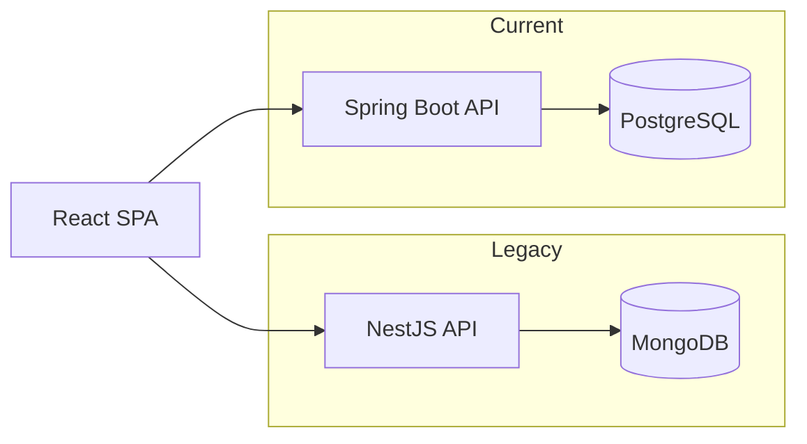
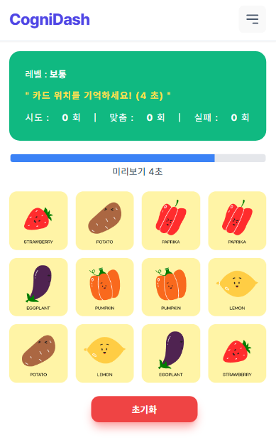
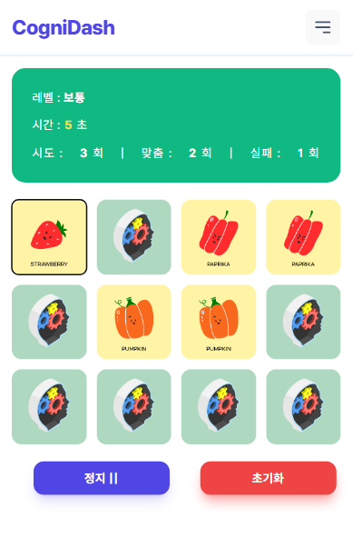
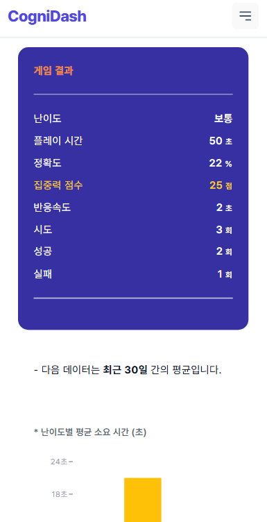
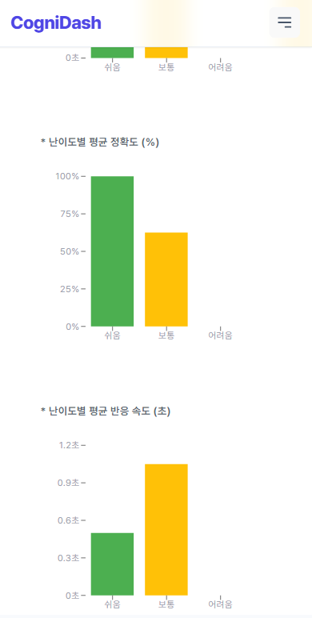
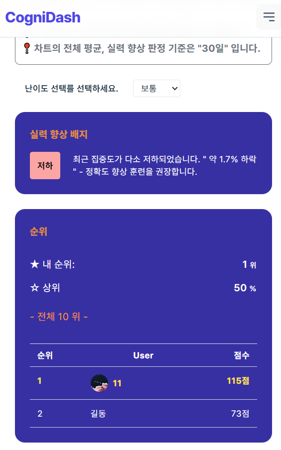
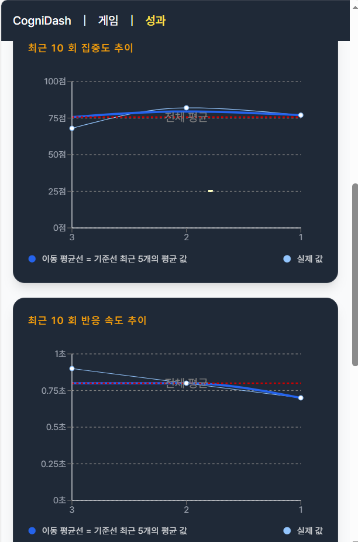
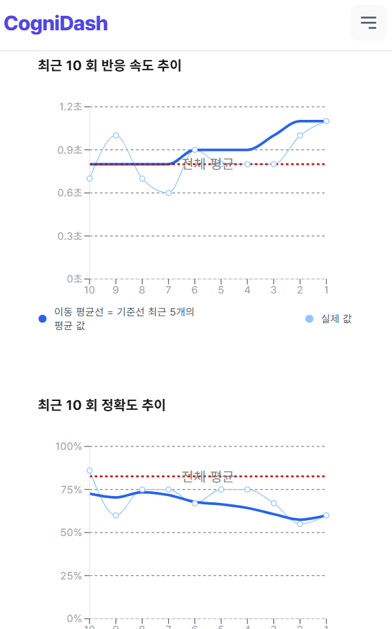
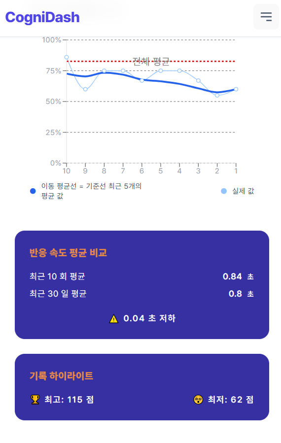

# Cognitive Training Analytics

**React · NestJS · Spring Boot 기반 인지 훈련 데이터 분석 웹 애플리케이션**

카드 매칭 게임에서 발생하는 **사용자 반응 데이터를 수집하고 분석하여 인지 성과를 시각화하는 풀스택 프로젝트**입니다.
초기 **NestJS(MongoDB)** 기반 시스템을 **Spring Boot 3(PostgreSQL)** 구조로 마이그레이션하여 데이터 무결성과 시스템 안정성을 개선했습니다.

---

# Architecture

```mermaid
graph LR

A[React SPA]

subgraph Legacy
B[NestJS API]
C[(MongoDB)]
end

subgraph Current
D[Spring Boot API]
E[(PostgreSQL)]
end

A --> B
B --> C

A --> D
D --> E
```

---

# 핵심 특징

### Backend Migration

기존 **NestJS(MongoDB)** 기반 백엔드를
**Spring Boot 3(PostgreSQL)** 구조로 재설계했습니다.

개선 사항

- RDBMS 기반 **데이터 무결성 확보**
- Java 17 **정적 타입 시스템 도입**
- **JPQL DTO Projection** 기반 조회 최적화
- 랭킹 조회를 위한 **인덱스 설계**

---

### 데이터 분석 시스템

게임 플레이 데이터를 분석하여 **Skill Score 알고리즘**으로 성과를 계산합니다.

분석 요소

- 반응 속도
- 정확도
- 난이도 가중치
- 실패 패널티

이를 통해 단순 점수가 아닌 **인지 성과 지표**를 생성합니다.

---

### 인증 및 보안 설계

- JWT Access / Refresh Token 인증
- Refresh Token Rotation
- 멀티탭 상태 동기화

---

### React SPA 성능 최적화

대시보드 페이지 렌더링 비용을 줄이기 위해 다음 최적화를 적용했습니다.

- Route Code Splitting
- Vite manualChunks 번들 분리
- Chart 렌더링 최적화

---

# 주요 화면

### 게임

<table>
<tr>
<td align="center">힌트</td>
<td align="center">진행</td>
<td align="center">현재 결과</td>
<td align="center">난이도 평균</td>
</tr>

<tr>
<td align="center"></td>
<td align="center"></td>
<td align="center"></td>
<td align="center"></td>
</tr>
</table>

---

### 성과 분석

<table>
<tr>
<td align="center">실력 판정</td>
<td align="center">최근 기록</td>
<td align="center">추이 그래프</td>
<td align="center">데이터 비교</td>
</tr>

<tr>
<td align="center"></td>
<td align="center"></td>
<td align="center"></td>
<td align="center"></td>
</tr>
</table>

---

# 기술 스택

### Frontend

- React 19
- TypeScript
- Vite
- Tailwind CSS
- Recharts

---

### Backend

**Spring Boot 3.5**

- Java 17
- Spring Security
- Spring Data JPA
- PostgreSQL

**NestJS (Legacy)**

- Node.js
- NestJS
- MongoDB
- Mongoose

---

### Dev / Tools

- JWT
- Playwright (E2E Test)
- Lighthouse

---

# 성능 결과 (Lighthouse)

| Page        | Before | After   |
| ----------- | ------ | ------- |
| Home        | 18     | **85+** |
| Performance | 4      | **86+** |
| Profile     | 35     | **89**  |

SPA 번들 분리 및 렌더링 최적화를 통해 **초기 성능 점수를 크게 개선했습니다.**

---

# 기술 문서

프로젝트 설계 과정과 트러블슈팅 기록은 아래 문서에서 확인할 수 있습니다.

### Spring Boot (Current)

**Spring Boot 마이그레이션 명세서**

- 아키텍처 전환 전략
- JPA 설계 및 트러블슈팅
- 인증 구조 구현

**[Spring Boot 기술 명세서](./docs/TECH-DETAILS-SPRING.md)**

---

### NestJS (Legacy)

**NestJS 시스템 설계 문서**

- 초기 시스템 아키텍처
- Skill Score 알고리즘
- 프론트엔드 성능 최적화 과정

**[NestJS 기술 명세서](./docs/TECH-DETAILS-NEST.md)**

---

# 프로젝트에서 얻은 경험

- NestJS → Spring Boot 백엔드 마이그레이션
- JWT 기반 인증 시스템 설계
- React SPA 성능 최적화
- 데이터 분석 알고리즘 설계
- 대시보드 데이터 시각화 구현
