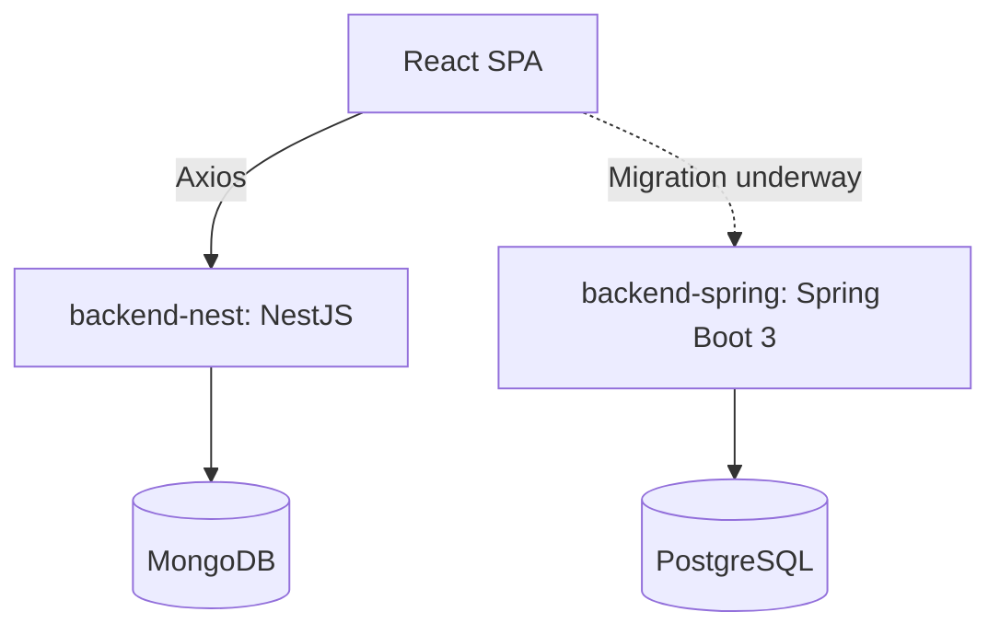

# 인지 훈련 성과 분석 시스템 (Cognitive Training Analytics)

**'React · NestJS 기반 풀스택 웹 애플리케이션'**

> 카드 매칭 게임 데이터를 수집·분석하여 **사용자 성과를 시각화**하며,
>
> **데이터 신뢰성, 인증 구조, 프론트엔드 성능 최적화**를 중심으로 설계하였습니다.

---

🚧 **현재 프로젝트 고도화 진행 중**

**Backend Migration:** `NestJS → Java Spring Boot 3`

- Spring 기반 백엔드 재설계 및 마이그레이션이 진행 중입니다.

---

## 프로젝트 개요

### 목적

단순 게임 구현이 아닌, 사용자의 반응 데이터를 신뢰할 수 있는 성과 지표(집중도 점수: Skill Score)로 분석하여 개인별 학습 성과를 객관적으로 평가하고 시각화하는 것을 목표로 합니다.

### 주요 기능

- 카드 매칭 기반 인지 훈련 게임 진행 및 기록 저장
- 서버 중심 데이터 관리로 **기록 신뢰성 확보**
- 사용자 반응 데이터를 분석하는 **성과 산출 알고리즘 설계**
  - 난이도 기반 점수 산출 및 집중도 분석
  - 실시간 랭킹 및 성장(성과) 그래프 제공
- **JWT Access / Refresh Token** 기반 사용자 인증

기술 구현의 상세 내용은 아래 문서에서 확인할 수 있습니다.

- NestJS 기반 기술 문서 → **[NestJS 기술 명세서](./docs/TECH-DETAILS-NEST.md)**

- Spring Boot 기반 재설계 문서 → **[Spring Boot 기술 명세서](./docs/TECH-DETAILS-SPRING.md)**

### 아키텍처

- **Legacy:** React SPA + NestJS + MongoDB
- **Target:** React SPA + Spring Boot 3 + PostgreSQL


```mermaid
graph TD
    Client[React SPA] -->|Axios| NestJS[backend-nest: NestJS]
    Client -.->|Migration underway| SpringBoot[backend-spring: Spring Boot 3]
    NestJS --> MongoDB[(MongoDB)]
    SpringBoot --> PostgreSQL[(PostgreSQL)]
```

### 폴더 구조

- **Frontend (`client/`)**

```

client/                 # Frontend (React SPA)
 ├── e2e/               # Playwright 기반 E2E 테스트
 └── src/
      ├── api/          # Axios 등 API 호출 관련 모듈
      ├── assets/       # 이미지, 폰트 리소스
      ├── auth/         # 인증 관련 훅/컴포넌트
      ├── components/   # 재사용 UI 구성 요소
      │    ├── charts/  # Recharts 컴포넌트
      │    ├── game/    # 게임 관련 UI 컴포넌트
      │    ├── layout/  # 레이아웃 관련 컴포넌트(App, Header 등)
      │    └── ui/      # 공통 UI 요소(Button, Card, Spinner 등)
      ├── config/       # 환경 설정 (게임 설정)
      ├── pages/        # 라우트 페이지 컴포넌트
      ├── hooks/        # 게임 로직, 타이머 훅
      ├── routes/       # createBrowserRouter 기반 라우팅
      ├── types/        # TypeScript 타입 정의
      ├── ui/           # UI 스타일/테마 (재사용 UI와 별도)
      └── utils/        # 공통 유틸리티 함수

```

- **Backend (Legacy: `backend-nest/src/`)**

```
backend-nest/src/   # Backend (NestJS API)
 ├── auth/          # 인증 모듈 (DTO, 인터페이스, 전략)
 ├── records/       # 게임 기록/성과 관리 (DTO, Enum, Schema, util)
 └── users/         # 사용자 관리 모듈 (DTO, Schema)

```

### 핵심 구현 포인트

- **JWT Access / Refresh Token** 인증 시스템 및 Refresh Rotation 적용
- 사용자 반응 데이터 기반 **집중도 점수(Skill Score) 산출 알고리즘 설계**
- 서버 기반 데이터 관리로 **기록 신뢰성 확보**
- **Route Code Splitting** 및 Vite 번들 분리로 SPA 초기 로딩 성능 개선
- React Dashboard 렌더링 최적화, **Lighthouse Performance 18 → 85+ 개선**
- Playwright 기반 **E2E 인증 테스트**로 인증 흐름 검증

---

## 주요 화면

### 게임 진행

<table>
<tr>
  <td align="center">힌트</td>
  <td align="center">진행</td>
  <td align="center">현재 결과</td>
  <td align="center">난이도별 평균</td>
</tr>
<tr>
  <td align="center" valign="top"></td>
  <td align="center" valign="top"></td>
  <td align="center" valign="top"></td>
  <td align="center" valign="top"></td>
</tr>
</table>

### 성과

<table>
<tr>
  <td align="center">실력 판정, 순위</td>
  <td align="center">최근 10회 기록</td>
  <td align="center">추이 그래프</td>
  <td align="center">비교 (반응 속도, 점수)</td>
</tr>
<tr>
  <td align="center" valign="top"></td>
  <td align="center" valign="top"></td>
  <td align="center" valign="top"></td>
  <td align="center" valign="top"></td>
</tr>
</table>

> **시각화**
>
> Recharts를 활용해 사용자의 성장 곡선을 한눈에 파악할 수 있도록 구성했습니다.

---

## 기술 스택

### Frontend

React 19, TypeScript, Vite, Tailwind CSS, Recharts, Axios, React Router

### Backend (Legacy)

Node.js 22, NestJS 11, MongoDB, Mongoose, Passport (JWT / Refresh Token), bcrypt, class-validator

### Backend (Migration Target)

Java 17, Spring Boot 3, PostgreSQL, Spring Security

### DevOps/Auth/Test

mkcert (Local HTTPS), JWT (Access/Refresh), Playwright (E2E), Lighthouse

---

## 성과 & 지표 (Frontend: NestJS / Legacy)

- **Performance 개선**
  - Home (/) Page: **18 → 85+**
  - Performance Page: **4 → 86+**

- **Accessibility / Best Practices**
  - **92+ / 96+**

→ SPA 구조에서 **번들 분리 및 렌더링 최적화를 통해 평균 4~20배 성능 개선**

---

## 프로젝트 문서

보다 상세한 기술 구현 내용, 성과 산출 알고리즘, 성능 최적화 과정은
아래 문서에서 확인할 수 있습니다.

### 🟢 Legacy (Stable)

- **[NestJS 기술 명세서](./docs/TECH-DETAILS-NEST.md)**: 기존 NestJS 기반 API 설계, MongoDB 스키마, 성능 최적화(Lighthouse) 기록

### 🔵 Migration (In Progress)

- **[Spring Boot 기술 명세서](./docs/TECH-DETAILS-SPRING.md)**: Java 17, Spring Boot 3 도입 배경, PostgreSQL 엔티티 설계 및 마이그레이션 전략 (진행 중)

---

## 프로젝트 목표

이 프로젝트를 통해 다음 역량을 학습하고 정리했습니다.

- React SPA 구조 및 NestJS API 서버 설계
- JWT 인증 구조와 Refresh Token Rotation 설계
- 데이터 시각화 대시보드 구현
- Lighthouse 기반 웹 성능 최적화 경험

---

## 성장 포인트

> **커스텀 알고리즘 설계**
>
> 단순 CRUD를 넘어, 인지 심리학적 요소를 반영한 점수 산출 로직을 직접 설계하며 백엔드 비즈니스 로직의 복잡성을 경험했습니다.

> **보안과 사용자 경험의 절충**
>
> JWT Rotation을 통해 보안을 강화하면서, BroadcastChannel을 이용하여 멀티탭 환경에서의 사용자 이탈을 방지하는 UX 최적화를 고민했습니다.
